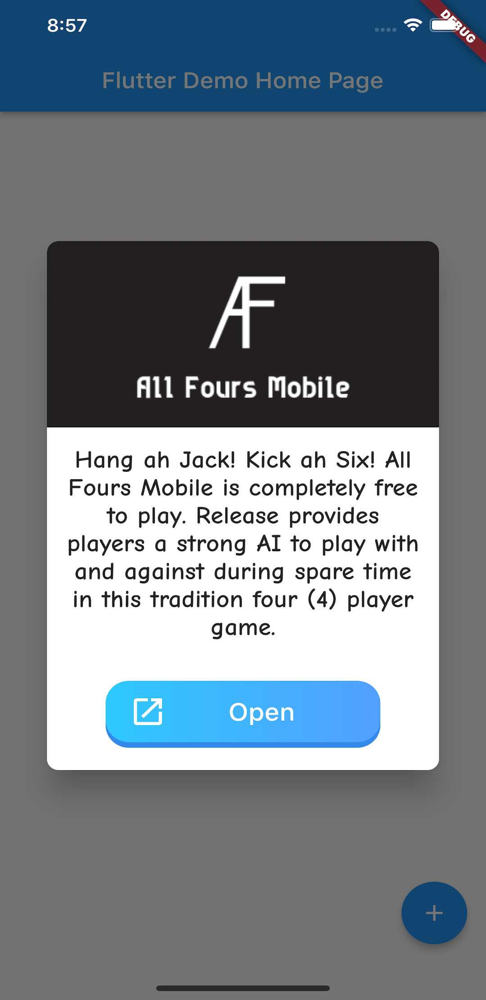

# Flutter_App_Popup_Ad

A Flutter plugin for app developers to advertise their own apps (or others) in in the form of a dialog/popup.


Android             | iOS 
:-------------------------:|:-------------------------:
 |  

## Install

In a terminal of your flutter project, run the command:

``` dart	
flutter pub add flutter_app_popup_ad
```

In your library add the following import:

``` dart
import 'package:flutter_app_popup_ad/flutter_app_popup_ad.dart';
```

## Usage

This package requires a list of apps that you will like to advertise. You will need to initialize the package with a `List<AppInfo>` or a public url that the package can fetch from. You can find a code example below

```dart 
@override
  void initState(){
    super.initState();
    WidgetsBinding.instance?.addPostFrameCallback((_) async {
      // set this if the host app is in the list of apps to advertise
      // prevents it from advertising itself
      flutterAppPopupAd.thisAppId = "om.Raziel619";
      
      await flutterAppPopupAd.initializeWithUrl('https://dev.raziel619.com/ariel/api/getpreviews', updateFreqDays: 1);
      // or you can use flutterAppPopupAd.initializeWithApps(apps)
      
      await flutterAppPopupAd.determineAndShowAd(context, freq: 0);
    });
  }
```

- `updateFreqDays` - sets the time interval that `initializeWithUrl` will fetch list of apps from url
- `freq` - sets the number of times the app must be opened to show the next ad. If set to 0, an ad will be shown everytime the `determineAndShowAd` method is called

Suggested approach is to call the package after your `main.dart` has returned a MaterialApp so that flutter's `showDialog` method can work.

## Limitations

Currently, this package only fully supports Android. For iOS, you can pass in a URL link to the app's page on the Apple app store and the package will direct users to there.

